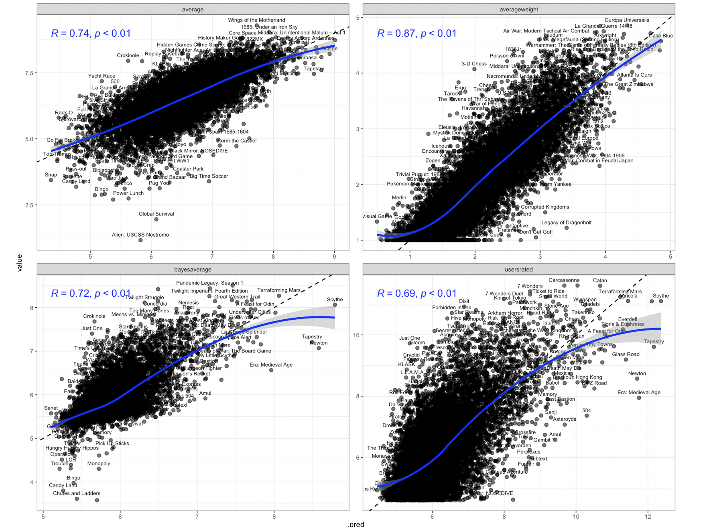
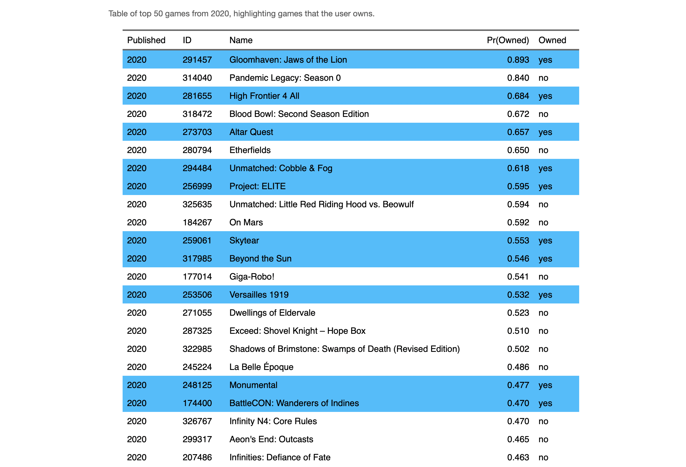

## Board Game Projects {-}

If you love boardgames and data, [**boardgamegeek.com**](https://boardgamegeek.com) is a treasure chest, with data from thousands of users on every boardgame in existence. What can we learn from this data? These are the projects I've been working on using techniques from data science with data from BGG. 

1. [**Predicting BGG's Top Upcoming Games**](upcoming_games_tables.html)

{width=45%} {width=45%}

What upcoming board games are **likely to be popular within the BGG community?** I train a variety of predictive models on historical BGG data in order to estimate a variety of outcomes for newly released games. Why are some games expected to better than others? How accurately can we predict upcoming games? What games are likely to become the new hotness? 

[Predictions](upcoming_games_tables.html) // [Methodology](predicting_bgg_outcomes.html)

Last updated: `r Sys.Date()`

2. [**Adjusting BGG Ratings: Complexity and 'The Hotness'**)](adjusting_bgg_ratings.html)

{width=45%} {width=45%}

I use a variety techniques to make adjustments to the Geek rating on boardgamegeek.First, I compute **Complexity-Adjusted Ratings** in order to identify which games get the most bang for their complexity buck. I am not the first to develop the method for computing these ratings, which is a very simple statistical model, but I do use that method to keep a list of up-to-date complexity ratings based on my latest pull of games from BGG. Second, I amend the formula for the geek rating to place a greater weight on the popularity of the game, which I have found can mitigate a tendency of the geek ratings to skew towards the 'the hotness'.

3. [**Predicting Collections, or How to Create an Artificial Shut Up and Sit Down**]()

{width=45%} {width=45%}

"What upcoming games should I check out?"

Rather than trying to predict how the boardgamegeek community will rate a game, I train models at the individual user level to predict whether someone will be likely to add an upcoming game to their collection. This started as a project to [train a model to identify games for myself](mrbananagrabber_2020.html), but then I realized that this could be extended to anyone with a boardgamegeek account and a decent number of games in their collection. This analysis can be run for anyone, so I've run it for a few prominent reviewers to see what upcoming games they're most likely to be interested in:

[Watch It Played](user_reports/Watch_It_Played_2020.html)

[Mark Bigney (So Very Wrong About Games)](user_reports/Gyges_2020.html)

[rahdo](user_reports/rahdo_2020.html)

[Quinns (Shut Up and Sit Down, though his data is a bit out of date)](user_reports/Quinns_2020.html)

[Zee Garcia (The Dice Tower)](user_reports/ZeeGarcia_2020.html)

[me](user_reports/rahdo_2020.html)

[my brother](user_reports/GOBbluth89_2020.html)

<!-- 4. [**Finding Boardgame "Neighbors"**](): -->

<!-- # -->

