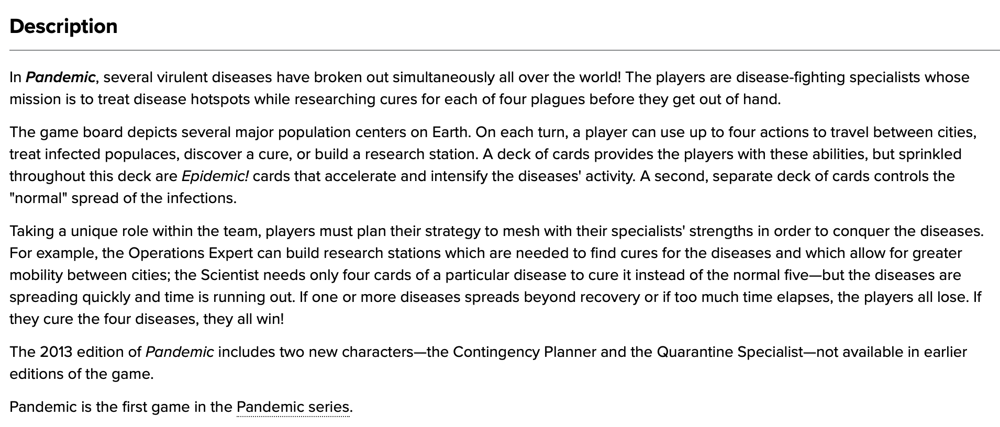

```{r setup, include=F, results = 'hide', message=F, warning=F}

source(here::here("src", "helpers", "exploratory_setup.R"))

```

```{r load functions for categorical, include=F} 

source(here::here("src", "functions", "categorical_functions.R"))

```


```{r create tidy games, include=F}

# set minimum ratings
min_ratings = params$min_ratings

# train year
train_year = params$train_year

# remove unreleased and problem games
tidy_games =
        analysis_games %>%
        # remove unreleased and problem games
        filter(!(game_id %in% c(
                unreleased_games$game_id,
                drop_games$game_id))
        ) %>%
        # filter out games with missingness on yearpublished
        filter(!is.na(yearpublished)) %>%
        # filter out games with missingness on average weight
        filter(!is.na(averageweight) & averageweight!=0) %>%
        # filter our kickstarter editions and big box editions
        filter(!(grepl("kickstarter|big box|mega box|megabox", name))) %>%
        # filter to games released prior to current year
        filter(yearpublished < year(Sys.Date())) %>%
        # filter to games with at least X votes
        filter(usersrated >= min_ratings) %>%
        # set yearpublished to numeric
        mutate(yearpublished = as.numeric(yearpublished)) %>%
        # join with description
        left_join(., 
                  game_descriptions %>%
                          select(game_id, description),
                  by = c("game_id"))

```

```{r functions and captions}

# caption
my_caption = 
        list(labs(caption = paste(paste("data from boardgamegeek.com as of", max(as.Date(tidy_games$load_ts))),
                                  #    paste("analysis by phil henrickson"),
                                  paste("phenrickson.github.io/data-analysis-paralysis/boardgames.html"), sep="\n")))

```

This notebook provides some basic exploratory analysis of games on boardgamegeek (BGG) in support of my work [predicting ratings for upcoming games] and [predicting games for individual users]. 

For this write up, I examine games published through `r train_year` that have achieved at least `r min_ratings` user ratings by the time of writing.[^ I have additionally excluded some games that were cancelled or never released, or have data quality issues with their profiles on BGG.]

```{r packages for text}

library(tokenizers)
library(textrecipes)
library(LiblineaR)

```


# Descriptions

Most games on BGG have a written description, typically from the publisher, which provides some basic information about the game.

<center>
{fig.width='70%'}
</center>

```{r examine game descriptions}

set.seed(5)
game_descriptions %>%
        filter(game_id %in% tidy_games$game_id) %>%
        sample_n(5) %>%
        select(game_id, description) %>%
        gt() %>%
        tab_options(table.font.size = 10,
                    container.overflow.y = T)

```

## Word Counts

One piece of information that we can examine immediately is a simple count of the number of words in a description. Plotting the distribution of word counts in descriptions, we can see we have a very right skewed distribution, with most games have 200-300 words with a select number of games having over 1000.

```{r description length}

p = game_descriptions %>%
        filter(game_id %in% tidy_games$game_id) %>%
        select(game_id, description) %>%
        mutate(word_count = count_words(description)) %>%
        select(game_id, word_count) %>%
        arrange(desc(word_count)) %>%
        ggplot(aes(x=word_count))+
        #  text = paste0("word count:", round(word_count, 0))))+
        geom_histogram(binwidth=10)+
        theme_phil()

plotly::ggplotly(p)
```

Is word count correlated with any of our outcomes? The answer appears to be yes, as I can plot each game's logged word count against each of the BGG outcomes I'm interested in.

Word count looks to be (weakly) positively correlated with average weight and average rating, and slightly less correlated with the geek rating and user ratings.

```{r examine word count}

game_descriptions %>%
        filter(game_id %in% tidy_games$game_id) %>%
        select(game_id, description) %>%
        mutate(word_count = count_words(description)) %>%
        select(game_id, word_count) %>%
        left_join(., tidy_games %>%
                          transmute(game_id,
                                    average,
                                    averageweight,
                                    bayesaverage,
                                    usersrated = log(usersrated)),
                  by = c("game_id")) %>%
        set_names(., tidy_names_func(names(.))) %>%
        mutate(`word_count (logged)` = log(word_count)) %>%
        ggplot(aes(x=.panel_x,
                   y=.panel_y))+
        geom_autopoint(alpha = 0.25,
                       size = 0.5)+
        geom_smooth(method = 'gam')+
        ggpubr::stat_cor(aes(label = ..r.label..),  label.x = 3)+
        facet_matrix(vars(`word_count (logged)`),
                     vars(-game_id, -word_count, -`word_count (logged)`),
                     grid.y.diag = F)+
        theme_bw()+
        theme(panel.grid.major = element_blank(),
              strip.text = element_text(size = 8))+
        my_caption

```

This isn't all that shocking; if we break games down by type we can see that wargames and strategy games tend to have longer descriptions, and these games generally have higher averages.

```{r plot with categories}

tidy_games %>%
        filter(!is.na(averageweight)) %>%
        filter(yearpublished <= train_year) %>%
        left_join(., game_descriptions %>%
                          mutate(word_count = count_words(description)) %>%
                          select(game_id, word_count),
                  by = c("game_id")) %>%
        transmute(game_id, 
                  word_count,
                  averageweight,
                  average,
                  bayesaverage,
                  usersrated = log(usersrated),
                  category = case_when(!is.na(rank_wargame) ~ 'wargame',
                                       !is.na(rank_strategy) ~ 'strategy',
                                       !is.na(rank_family) ~ 'family',
                                       !is.na(rank_abstract) ~ 'abstract',
                                       !is.na(rank_party) ~ 'party',
                                       TRUE ~ 'other')) %>%
        mutate(word_count = replace_na(word_count, 0)) %>%
        group_by(category) %>%
        mutate(median = median(word_count, na.rm=T)) %>%
        ggplot(aes(x=word_count,
                   fill = category,
                   y=reorder(category, median)))+
        ggridges::stat_density_ridges(alpha = 0.5,
                                      bandwidth = 21,
                                      quantile_lines =T,
                                      quantiles = 2,
                                      color = 'white')+
        xlab("word count (logged)")+
        scale_fill_brewer(palette = 'Set2')+
        theme_phil()+
        guides(fill = 'none')+
        xlab("word count")+
        ylab("")

```

Some wargames in particular seem to have _extremely_ detailed descriptions.

```{r view long descriptions}

set.seed(5)
game_descriptions %>%
        filter(game_id %in% tidy_games$game_id) %>%
        mutate(word_count = count_words(description)) %>%
        slice_max(word_count, n =5, with_ties = F) %>%
        select(game_id, word_count, description) %>%
        gt() %>%
        tab_options(table.font.size = 10,
                    container.overflow.y = T)

```

There's also the possibility of leakage in descriptions, where games that have been popular get expansions and text about these are then added to the game's original description. 

## Word Frequencies

```{r word frequencies}

library(stopwords)
library(SnowballC)

stemmed = game_descriptions %>%
        filter(game_id %in% tidy_games$game_id) %>%
        select(game_id, description) %>%
        unnest_tokens(output = word,
                      input = description,
                      token = 'words') %>%
        # standard stop words
        anti_join(get_stopwords(),
                  by = "word") %>%
        # digits (player counts)
        anti_join(tibble(word = as.character(seq(0, 9, 1))),
                  by = "word") %>%
        # stem with different methods
        mutate(`Remove S` = str_remove(word, "s$"),
               `Plural endings` = case_when(str_detect(word, "[^e|aies$]ies$") ~
                                                    str_replace(word, "ies$", "y"),
                                            str_detect(word, "[^e|a|oes$]es$") ~
                                                    str_replace(word, "es$", "e"),
                                            str_detect(word, "[^ss$|us$]s$") ~
                                                    str_remove(word, "s$"),
                                            TRUE ~ word),
               `Porter stemming` = wordStem(word))

stemmed %>%
        pivot_longer(names_to = c("type"),
                     values_to = c("stem"),
                     cols = -c(game_id, word)) %>%
        mutate(type = fct_inorder(type)) %>%
        count(type, stem) %>%
        group_by(type) %>%
        top_n(25, n) %>%
        ggplot(aes(fct_reorder(stem, n),
                   n,
                   fill = type)) +
        geom_col(show.legend = FALSE) +
        facet_wrap(~type, scales = "free_y") +
        coord_flip() +
        labs(x = NULL,
             y = "Frequency")+
        scale_fill_brewer(palette = 'Dark2')+
        theme_phil()

```

## N-grams

```{r ngrms}

ngrams = tidy_games %>%
        select(game_id, description) %>%
        unnest_tokens(token,
                      description,
                      token = 'ngrams',
                      n = 3) %>%
        separate(token, into = c("word1", "word2", "word3"), sep=" ") %>%
        filter(!word1 %in% stop_words$word) %>%
        filter(!word2 %in% stop_words$word) %>%
        filter(!word3 %in% stop_words$word)

library(igraph)
ngram_counts <- ngrams %>%
        count(word1, word2, word3, sort = TRUE) %>%
        filter(n > 15) %>%
        graph_from_data_frame()

```


```{r bigram graph, fig.height = 6}

library(ggraph)

a <- grid::arrow(type = "closed", length = unit(.15, "inches"))

ngram_counts %>%
        ggraph(layout = "fr") +
        geom_edge_link(aes(edge_alpha = n), show.legend = FALSE,
                       arrow = a, end_cap = circle(.07, 'inches')) +
        geom_node_point(color = "lightblue", size = 5) +
        geom_node_text(aes(label = name), vjust = 1, hjust = 1) +
        theme_void()

```

## Modeling

```{r tune}

# folds
set.seed(1999)
train_folds <- vfold_cv(tidy_games,
                        strata = average,
                        v = 5)

# recipe
text_rec = recipe(~.,
                  data = tidy_games %>%
                          select(game_id, average, description)) %>%
        update_role(average,
                    new_role = "outcome") %>%
        update_role(game_id,
                    new_role = "id") %>%
        # add word count as a feature
        step_mutate(word_count = stringi::stri_count_words(description)) %>%
        step_tokenize(description, 
                      token = "ngrams", options = list(n = 3, n_min = 1)) %>%
        step_tokenfilter(description, max_tokens = tune()) %>%
        step_tfidf(description) %>%
        step_normalize(all_predictors())

# model 
# svn
# svm_spec <- svm_linear() %>%
#         set_mode("regression") %>%
#         set_engine("LiblineaR")

# penalized regression
glmnet_spec = parsnip::linear_reg(mixture = 1, 
                                     penalty = .001,
                                     engine = 'glmnet')

# specify grid for tuning
glmnet_grid <- tibble(penalty = 10^seq(-3, -1, 
                                       length.out = 20))

# workflow
tune_wf <- workflow() %>%
        add_recipe(text_rec) %>%
        add_model(glmnet_spec)

# grid to tune tokens
tokens_grid <- grid_regular(
        max_tokens(range = c(100, 2000)),
        levels = 6
)

# combine
cross_grid = crossing(glmnet_grid,
                      tokens_grid)
        

```

```{r tune}

# tune tokens
tune_rs <- 
        tune_wf %>%
        tune_grid(.,
                  resamples = train_folds,
                  grid = tokens_grid,
                  metrics = metric_set(rmse, mae, mape, rsq),   
                  control = control_resamples(save_pred = TRUE)
        )

```


```{r examine performance}

# tune resampling
tune_rs %>%
        collect_metrics() %>%
        ggplot(aes(x=max_tokens,
                   y=mean))+
        geom_line(size = 1.5, alpha = 0.5) +
        geom_point(size = 2, alpha = 0.9) +
        facet_wrap(~.metric, 
                   ncol = 2,
                   scales = "free_y") +
        theme_phil()+
        theme(legend.position = "none") +
        labs(
                x = "Number of tokens",
                title = "Lasso performance by number of tokens"
        )

```


```{r correlation}

# fit
final_fitted <- tune_wf %>%
        finalize_workflow(parameters = tune_rs %>% 
                                  select_best(metric = 'rmse')) %>%
        fit(tidy_games)

```

```{r extract}

final_fitted %>%
        extract_fit_parsnip() %>%
        tidy() %>%
        filter(term != '(Intercept)') %>%
        mutate(
                sign = factor(case_when(estimate > 0 ~ "Increases average rating",
                                 TRUE ~ "Decreases average rating"),
                              levels = c(
                                      "Increases average rating",
                                      "Decreases average rating")),
                estimate = abs(estimate),
                term = str_remove_all(term, "tfidf_description_")
        ) %>%
        group_by(sign) %>%
        top_n(20, estimate) %>%
        ungroup() %>%
        ggplot(aes(x = estimate,
                   y = fct_reorder(term, estimate),
                   fill = sign)) +
        geom_col(show.legend = FALSE) +
        scale_x_continuous(expand = c(0, 0)) +
        facet_wrap(sign~.,
                   scales = "free") +
        scale_fill_manual(values = c("navy", "orange"))+
        theme_phil()+
        ylab("")

# final_fitted %>%
#         extract_fit_parsnip() %>%
#         tidy() %>%
#         filter(term != "Bias") %>%
#         mutate(term = gsub("tfidf_description_", "", term)) %>%
#         slice_max(abs(estimate), n=40) %>%
#         ggplot(aes(x=estimate,
#                    fill = estimate,
#                    y=reorder(term, estimate)))+
#         geom_col()+
#         theme_phil()+
#         guides(fill = 'none')+
#         scale_fill_gradient2()
        

```
                
```{r examine}

augmented = final_fitted %>%
        augment(analysis_games %>%
                        left_join(.,
                                  game_descriptions %>%
                                          select(game_id, description)) %>%
                        filter(yearpublished == 2022))

p = augmented %>%
        filter(usersrated > 50) %>%
        select(game_id,
               name,
               description,
               average,
               .pred
               ) %>%
        mutate(word_count = count_words(description)) %>%
        ggplot(aes(x=.pred,
                   color = log(word_count),
                   text = paste0(
                           paste("name:", name),
                           "\n",
                           paste("id:", game_id),
                           "\n",
                           paste("pred:", round(.pred, 3)),
                           "\n",
                           paste("average:", round(average, 3))),
                   y=average))+
        geom_point(size = .5)+
        # geom_text(check_overlap = T,
        #           size = 2,
        #           vjust = -1)+
        coord_cartesian(xlim = c(2, 10),
                        ylim = c(2, 10))+
        theme_phil()+
        scale_color_gradient(low = "red",
                             high = "blue")

plotly::ggplotly(p, 
                 tooltip = 'text')

```

